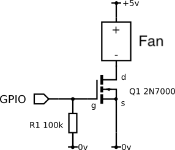

# rpi-temp-control
A lightweight service that cools raspberry pi cpu temperature by pwm fan.

## Hardware Set-up
Requires MOSFET setup connect to one of hardware control PWM pins



# Setup Temp Control Upon Startup

1. use sudo to install required packages 
   (It may fail to import package if not root pip3)
   ```console
   sudo pip3 install
   ```
2. modify your ```temp-controller/controller.py``` path according to your local in 
   ```service/cpu-temp-control.service```
3. ```console
    sudo cp ./cpu-temp-control.service /etc/systemd/system/cpu-temp-control.service
    ```
4. Reload the daemon 
   ```console
   sudo systemctl daemon-reload
   ```
5. Enable service 
   ```console
   sudo systemctl enable cpu-temp-control.service
   ```
6. Start service 
   ```console
   sudo systemctl start cpu-temp-control.service
   ```

- To stop service 
  ```console
  sudo systemctl stop cpu-temp-control.service
  ```

# Debugging

- Check service status:
   ```console
   systemctl status cpu-temp-control
   ```

- Check error traceback from the service
    - get PID of the service 
      ```console
      systemctl status cpu-temp-control | grep -oP '(?<=PID: )[0-9]+'
      ```
    - then get error traceback from PID 
      ```console
      journalctl _PID=$PID
      ```
